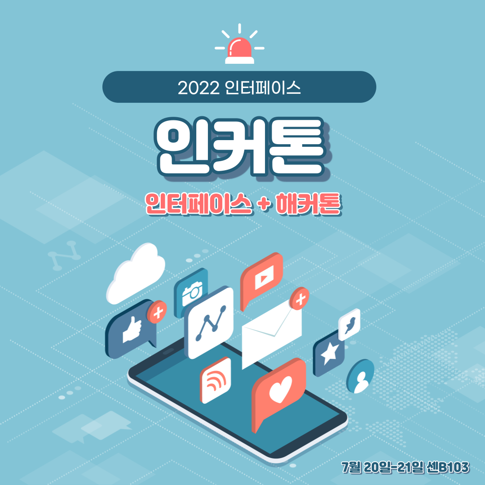

# 2022 인터페이스 해커톤 

  

> 장소 : 2022년 7월 20일 수요일 - 7월 21일 목요일 센B103

## 세종대학교 공지 알리미 디스코드 봇 - 규태는 상욱이를 좋아해 (31기 박상욱, 35기 박규태)
> 인터페이스 디스코드에서 사용할 있는 세종대학교 공지 알리미 디스코드 봇

  

## 내 인페 레벨은? - 파워레인조 (35기 박세현, 오세호, 이은주, 조형석, 황희정)
> 인터페이스 활동 참여율을 경험치로 보여주는 웹 서비스

  

  
  

## 보글부글 - 상욱이는 규태를 싫어해 (31기 이현주, 32기 권하윤, 동기창, 34기 이규리)
> 게으른 1인 가구를 위한 집안일 관리 어플케이션

  

                                                                                                                                        

 
 

                                                                                                                                                                                                                                                                        
                                                                                                                                         
                                                                                                                                         
