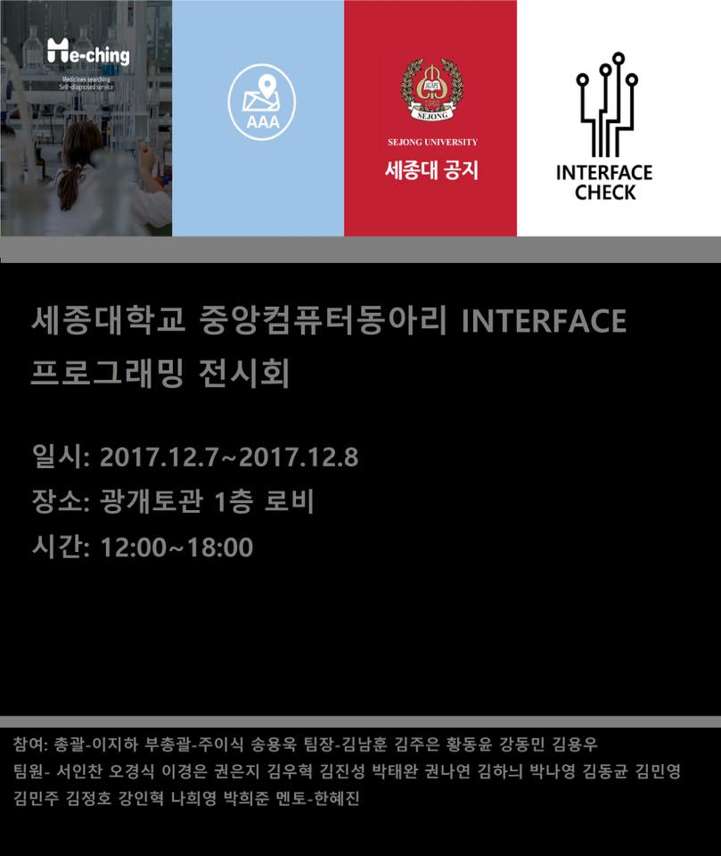

# 2017 인터페이스 프로그래밍 전시회 (제 1회)

- 주제 : JAVA

  

## 1팀 - MeChing

> 사용자의 증상에 따라 증상완화를 돕는 약을 매칭해주는 어플

- 사용자 위치를 중심으로 가까운 곳에 운영 중인 약국, 혹은 약이 구비되어있는 편의점을 찾아주는 기능을 탑재했습니다.
- 또, 사용자의 증상을 정확하게 파악하기 위한 설문 조사를 실시하 후 진단내린 질병들을 나열해 주고 각 질병마다 추가 증상을 보여주며 자신의 상태와 가장 유사한 질병을 선택하게 하는 기능이 있습니다.
- 질병을 선택한 후에는 그 질병에 맞는 대표적인 약 3가지를 추천해주는 기능도 있습니다.
- 만약 일반의약품으로 증상을 완화할 수 없는 질병이라면 가까운 병원을 추천해 주는 기능도 있습니다.

 

<!-- [sejong-interface/2017-MeChing_Medicine_Searching](https://github.com/sejong-interface/2017-MeChing_Medicine_Searching) -->
<!-- [Me-ching - Apps on Google Play](https://play.google.com/store/apps/details?id=test.com.a1team_meching) -->

## 2팀 - AAA(ATM 위치 알림)

> 사용자 주변의 ATM 기기 위치를 알려주는 어플

- GPS를 이용해서 사용자의 위치를 파악하거나, 사용자가 설정한 위치 주변의 ATM기기의 위치를 지도에 표시해 주는 기능이 있습니다.
- 사용자가 설정한 위치 주변의 ATM기기도 표시해 줍니다.
- 또한 사용자의 주거래 은행도 설정할 수 있어서 해당 은행의 ATM기기만 지도 상에 띄워주는 것도 가능합니다.

## 3팀 - 세종대 공지

> 세종대학교의 공지를 편하게 보여주는 어플

- 6개의 카테고리(공지, 입학, 학사, 국제, 취업, 모집)의 공지사항을 보기 쉽게 제공해주는 기능이 있습니다.
- 도서관 열람실 별 좌석 정보 현황을 실시간으로 알려주는 기능도 탑제 했습니다.

 

<!-- [sejong-interface/2017-Sejong-notice](https://github.com/sejong-interface/2017-Sejong-notice) -->
<!-- [세종대 공지 - Apps on Google Play](https://play.google.com/store/apps/details?id=com.project.a3team.afinal) -->

## 4팀 - 인터페이스 체크

> 인터페이스 동아리 부원들의 원활한 활동을 지원하기 위한 어플

- 정기 회의 진행 시, 동아리 회원들이 회의에 참여했는지를 체크해주는 기능이 있습니다.
- 그 외에도 동아리 공지사항을 안내해주는 기능, 게시판 기능, 재학생 명부를 띄워주는 기능, 동아리 관련 정보를 제공해주는 페이지로 연결해주는 기능 등이 있습니다.

 

<!-- [sejong-interface/2017-Interface_Check](https://github.com/sejong-interface/2017-Interface_Check) -->
<!-- [인터페이스 체크 - Apps on Google Play](https://play.google.com/store/apps/details?id=org.riyenas.interface_check) -->
