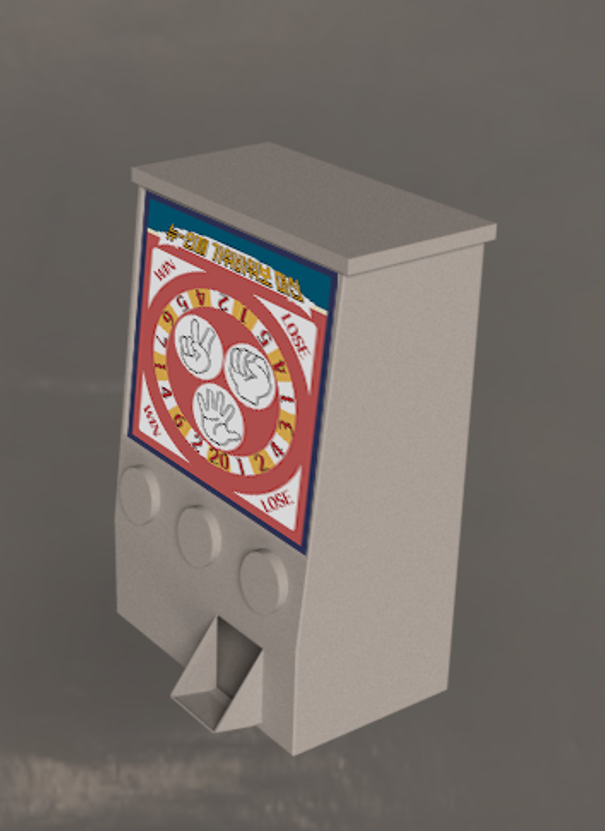

# 2018 인터페이스 프로그래밍 전시회 (제 2회)

  

[프로그래밍 전시회 기사](https://m.blog.naver.com/sejong_univ/221185221911)

## 1팀 - 저 세상 여행지 추천 어플

> 앱 인벤터를 이용해 만든 똑똑한 여행지 추천 어플리케이션

  

# 2팀 - 배틀두더지

> 하늘에서 떨어지는 두더지를 총으로 쏘는, 컨트롤러를 이용한 VR FPS 게임

  

## 4팀 - Catch me if you can

> 제한 시간 동안 1P는 2P를 피해다녀야 하고, 2P는 1P를 잡아야 하는 2인용 게임

  

## 5팀 - Stack Tower

> 고전적인 탑 쌓기 게임에 개성적인 요소를 첨가한 게임

  

## 6팀 - 아두이노 게임 컨트롤러

> 아두이노 컨트롤러를 이용한 실사 그래픽 FPP 게임

  

## 7팀 - RSP machine

> 아두이노를 이용한 가위바위보 동전 기계

  

