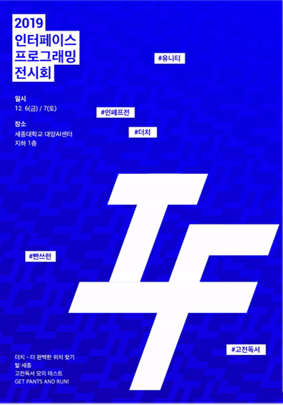

# 2019 인터페이스 프로그래밍 전시회 (제 3회)

  

## 더치 - 더 완벽한 위치찾기

- 사용자가 입력한 위치들의 중간 지점을 찾아주는 어플리케이션

<!-- 더치 -->
<table>
  <tr>
    <td align="center"></td>
    <td align="center"></td>
  </tr>
  <tr>
    <td align="center"><b>Github repo</b> </td>
    <td align="center"><b>Google PlayStore</b> </td>
  </tr>
</table>
<!-- 더치 -->

<!-- 더치 -->
<table>
  <tr>
    <td align="center"></td>
    <td align="center"></td>
  </tr>
  <tr>
    <td align="center">Github repo</td>
    <td align="center">Google PlayStore</td>
  </tr>
</table>
<!-- 더치 -->

[2019androidtp/Dutch](https://github.com/2019androidtp/Dutch)

[더치 - 더 완벽한 위치찾기 - Google Play 앱](https://play.google.com/store/apps/details?id=com.dutch2019&hl=ko)

## 고전독서

- 세종대 고전 독서 모의 테스트 어플리케이션
- 구글 play store 에 출시 했었으나, 지금은 삭제됨 ㅠ_ㅠ

[sejong-interface/2019_Classical_Reading](https://github.com/sejong-interface/2019_Classical_Reading)

## 상욱이는 뻐거킹을 좋아해

- 세종대를 배경으로 한 학교 투어 프로그램

센에서 바라본 학관

[sejong-interface/2019_SangWook_Loves_BBurgerKing](https://github.com/sejong-interface/2019_SangWook_Loves_BBurgerKing)

## **빤쓰런**

- 동아리 부원의 빤쓰를 훔쳐서 달리는 횡스크롤 2D 게임

[sejong-interface/2019_Get_pants_and_run](https://github.com/sejong-interface/2019_Get_pants_and_run)
