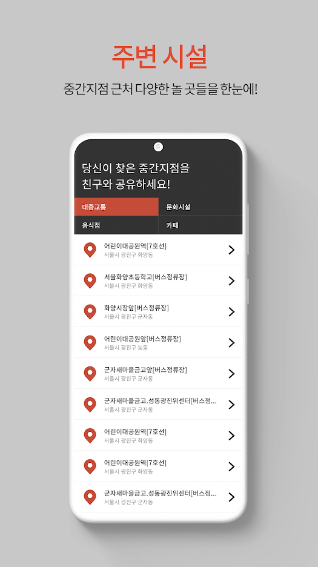

# 2019 인터페이스 프로그래밍 전시회 (제 3회)

  

## 더치 - 더 완벽한 위치찾기

> 사용자가 입력한 위치들의 중간 지점을 찾아주는 어플리케이션

 

  
  
  

  
  
  

## 고전독서

> 세종대 고전 독서 모의 테스트 어플리케이션

- 구글 play store 에 출시했었으나, 현재는 삭제됨

  

## 상욱이는 뻐거킹을 좋아해

> 세종대를 배경으로 한 학교 투어 프로그램

  

## 빤쓰런

>  동아리 부원의 빤쓰를 훔쳐서 런하는 횡스크롤 2D 게임

  

