# 2022 인터페이스 프로그래밍 전시회

  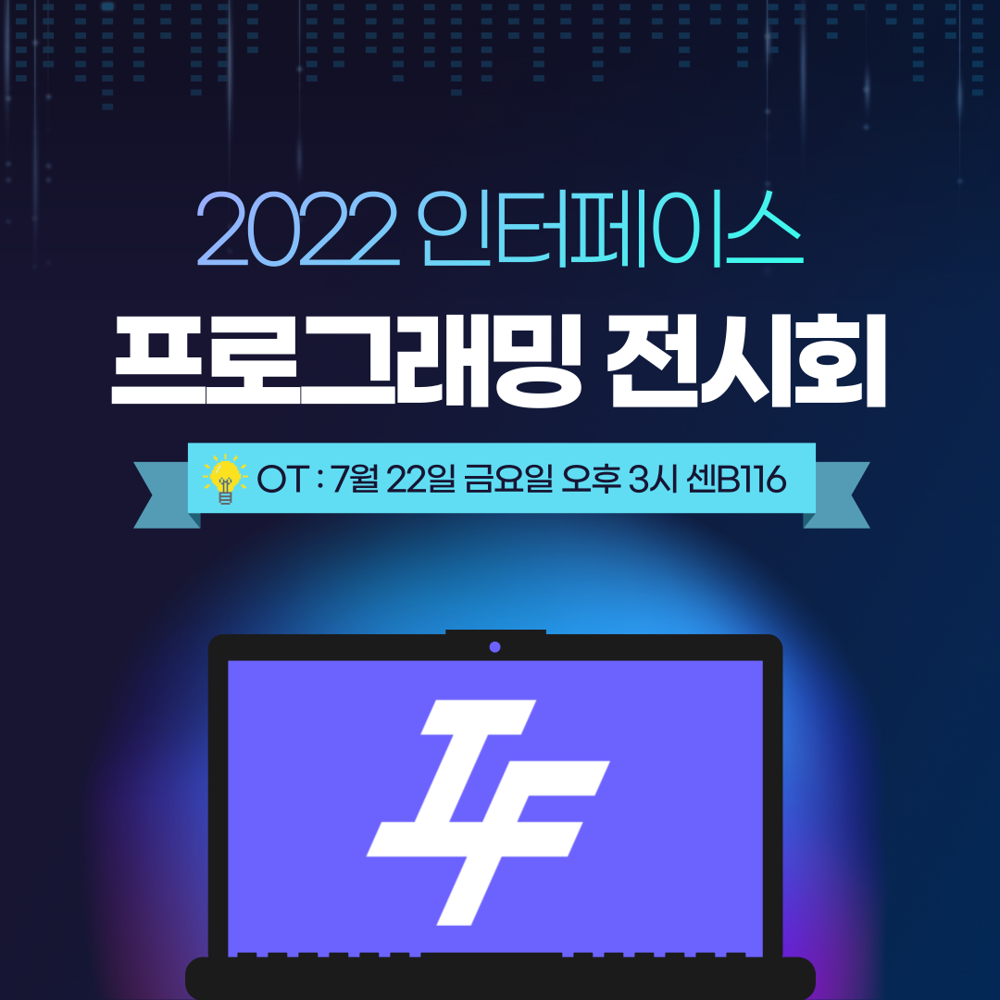

## 내가 인터페이스의 집부가 된다면??
> 인터페이스 집부를 비롯한 동아리 안에서의 역할(동방 지박령등..)들의 각 특징들을 바탕으로 선지를 구성한 뒤, 선택한 선지들을 바탕으로 분석하여 어울리는 역할을 알려주는 웹페이지

  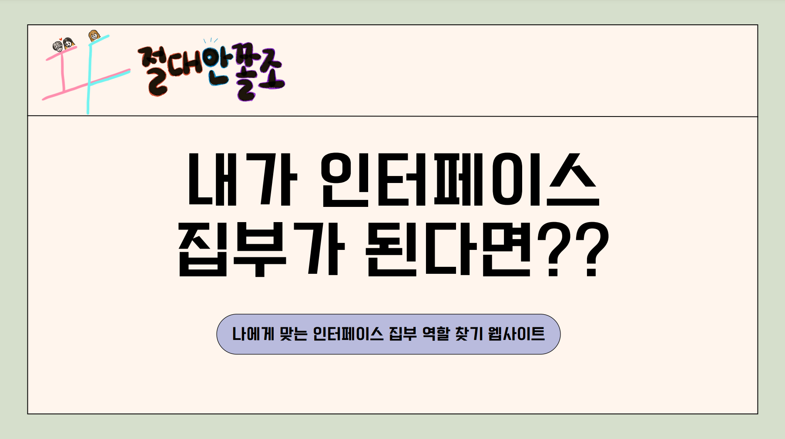

## 동방런
> 인터페이스 동아리 회원들이 공감할 수 있는 스토리의 횡스크롤 러닝 액션 게임

  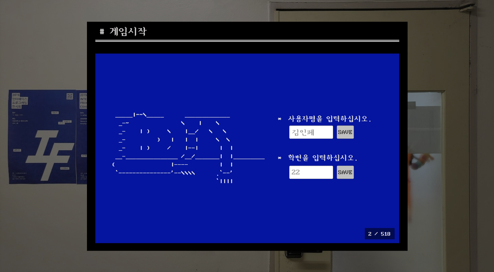

## 인터페이스 기술 블로그
> 동아리에서 진행한 프로젝트를 기록하고 인터페이스 홍보 및 홈페이지 활성화

  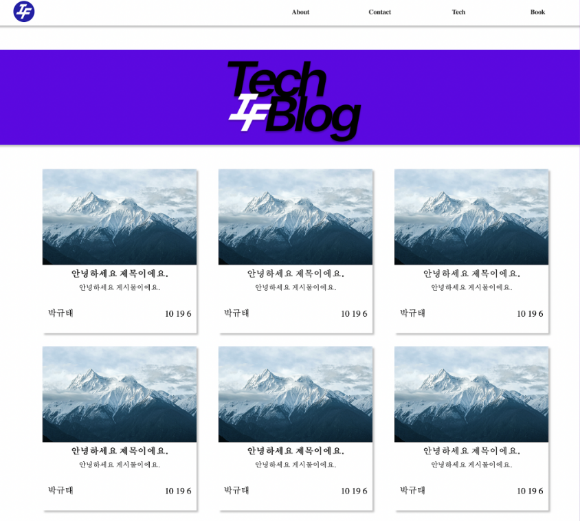

## Stack-Oversky
> 제 2회 프로그래밍 전시회 작 ‘Stack Tower’를 디벨롭한 게임! 상대보다 탑을 먼저 쌓거나 목표로 하는 위치까지 빨리 도달하는 내용의 픽셀 그래픽을 이용한 2D 멀티 탑쌓기 게임

  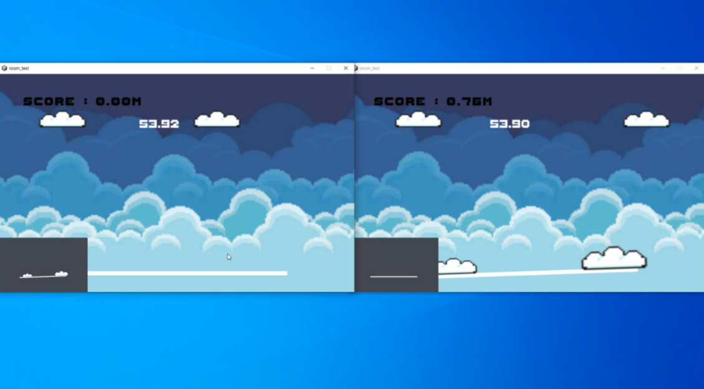

## 인터페이스 챗봇
> 인터페이스 동아리원과 세종대학교 학생들이 인터페이스에 대해서 궁금한 점이나 알고 싶은
점이 있을 때 이용할 수 있는 챗봇

  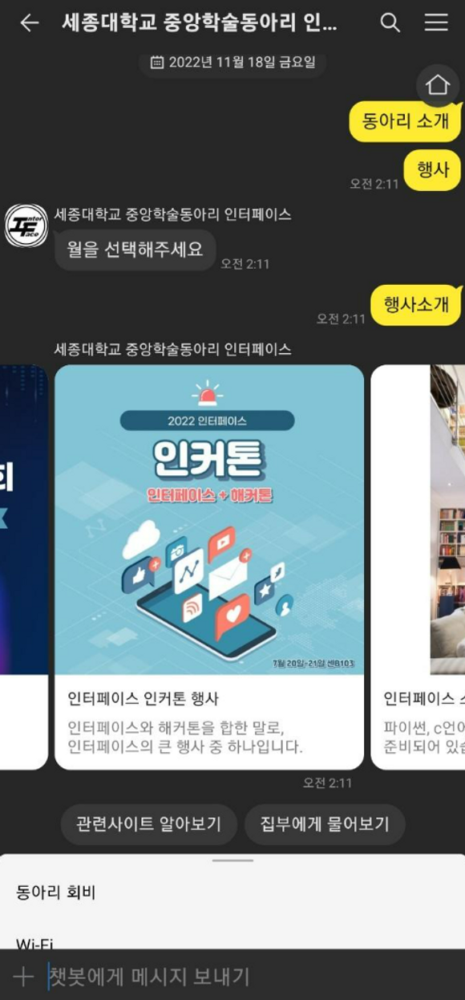

## 인터페이스 커뮤니티 어플
> 인터페이스 만의 어플의 필요성을 느끼고 이에 따라 각종 기능들을 구현하기 위해 기획

  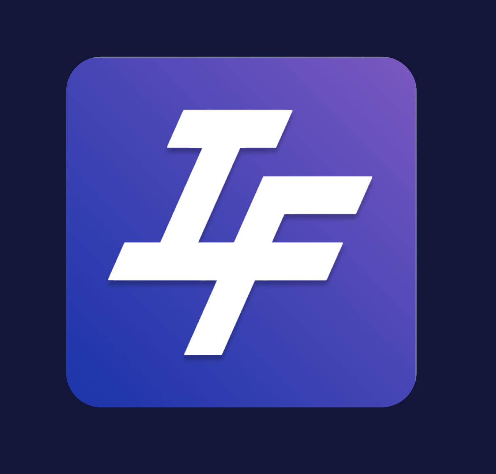

  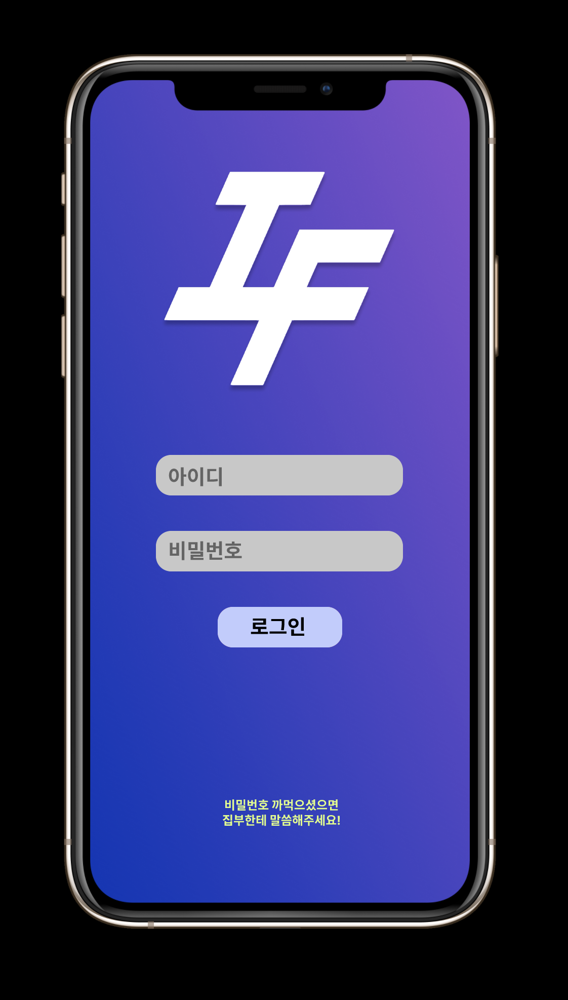
  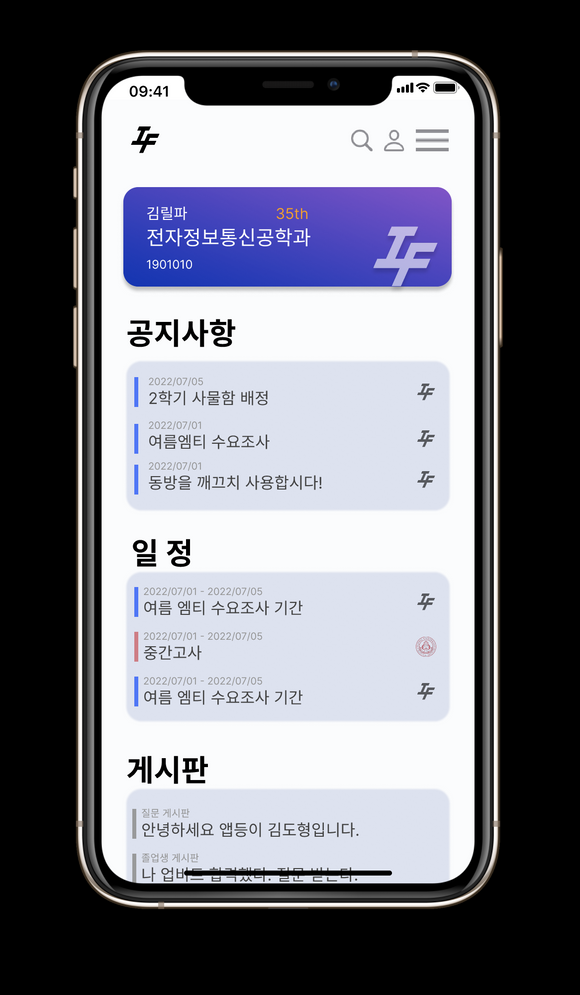

  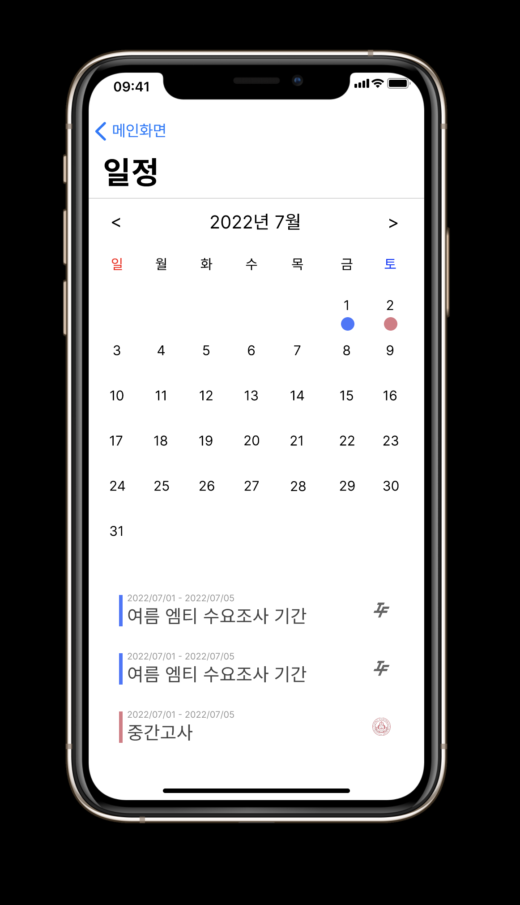
  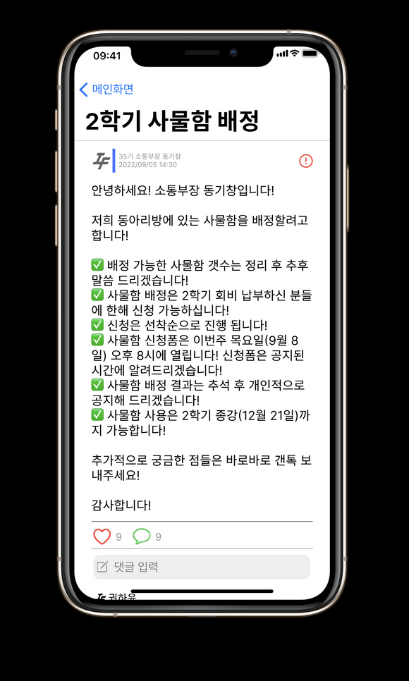

