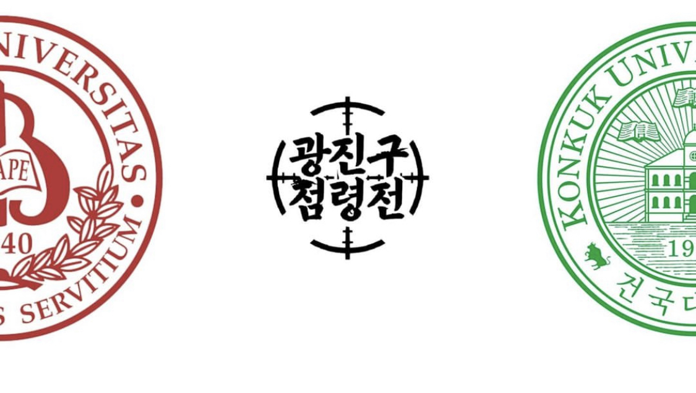
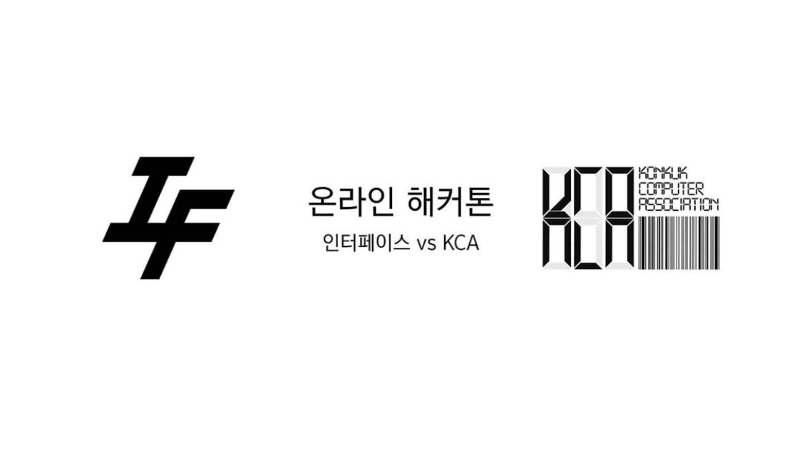
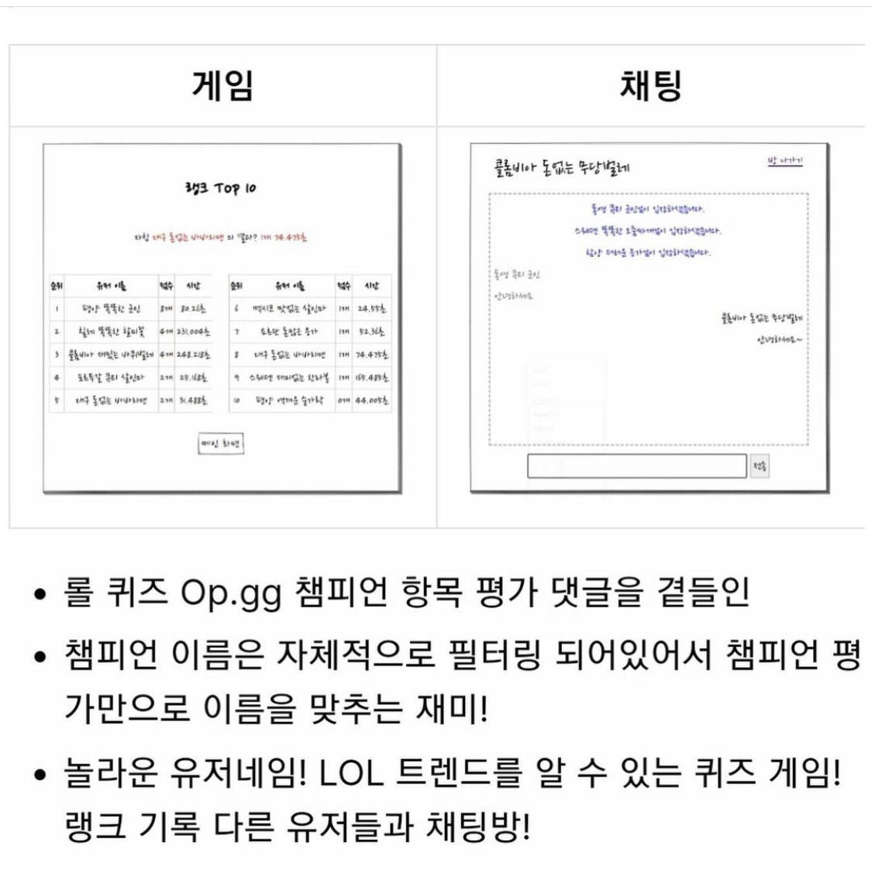
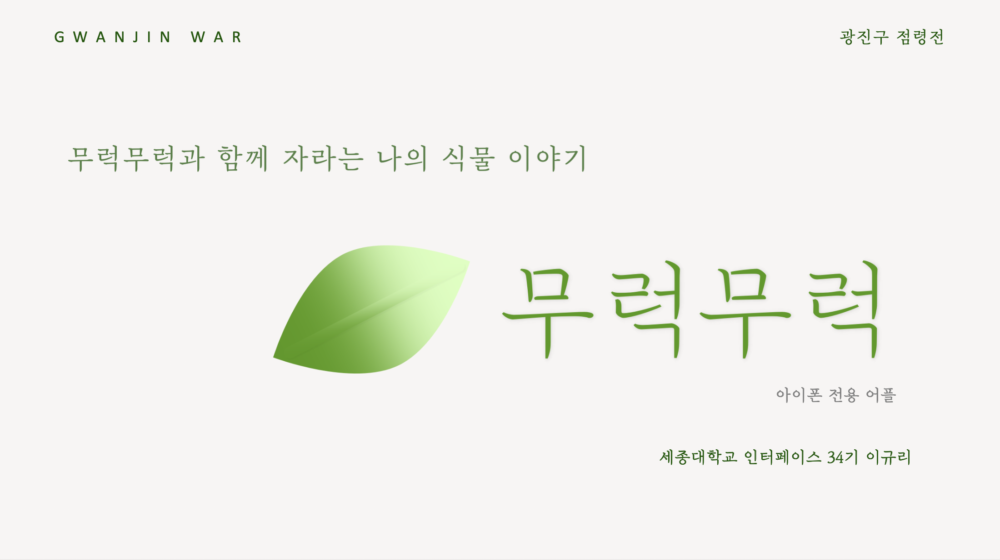
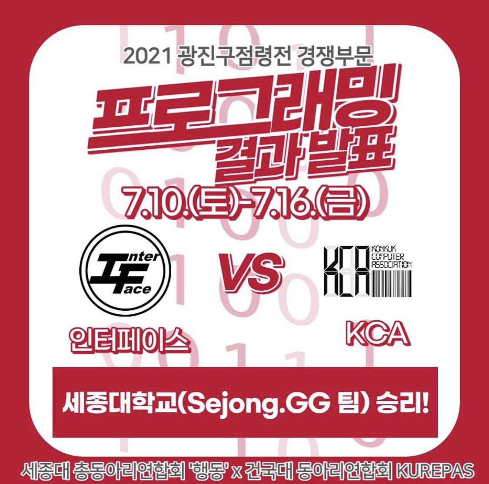

# 2021 인터페이스 해커톤 (광진구 점령전)

## 광진구 점령전

  
  

세종대학교 인터페이스 vs 건국대학교 KCA 

## 1팀 sejong.GG (김하늬, 강동민, 서대현, 김정호)

  

> LOL 관련 퀴즈 사이트

- 챔피언 평가만으로 LOL 챔피언 이름을 맞추는 사이트
- LOL 트렌드를 알 수 있는 퀴즈 게임

## 2팀 무럭무럭 (이규리)

  

> 반려 식물 어플 (ios)

- 식물 입양 날짜 등록
- 식물 물 주는 주기 별 알람
- 식물 정보 수정
- 물 주는 날짜 기준으로 급한 날짜로 정렬
- 물 주면 주기 초기화

## 우승팀 sejong.GG (김하늬, 강동민, 서대현, 김정호)

  

